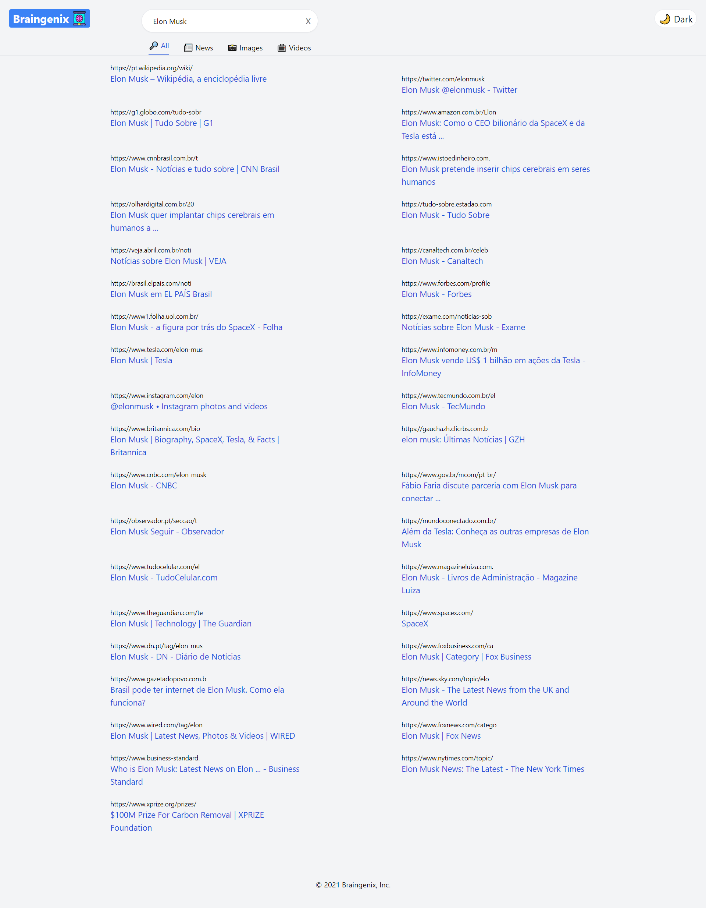

## A Simple Search Engine

[Braingenix](https://braingenix.vercel.app/) is a simple search engine app, you can use it to search for anything on the internet using [Google Search API](https://rapidapi.com/apigeek/api/google-search3/)

This project was bootstrapped with [Create React App](https://github.com/facebook/create-react-app)
, The Styling is made with [TailwindCSS](https://tailwindcss.com/)
, The App is deployed on [Vercel](https://vercel.com/)

you can visit the website at [braingenix.vercel.app](https://braingenix.vercel.app/)

## Homepage Page

## Image Search

